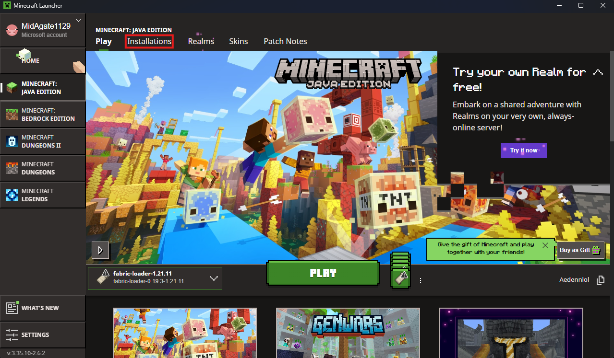
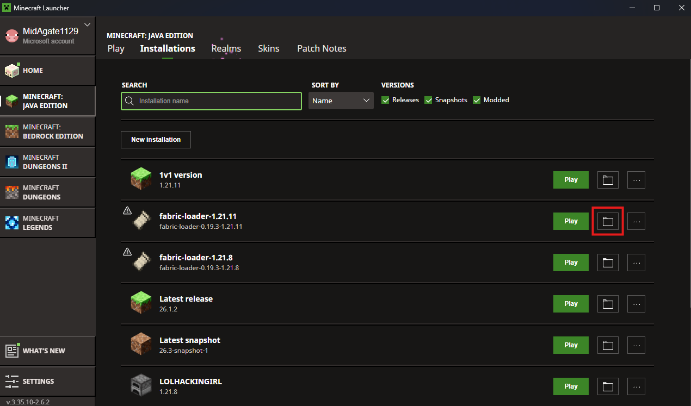
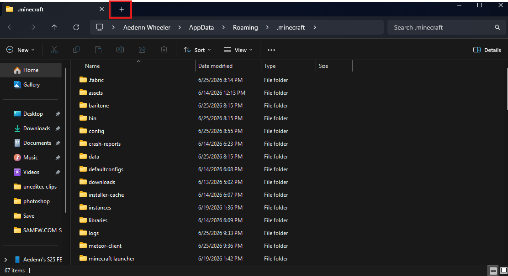
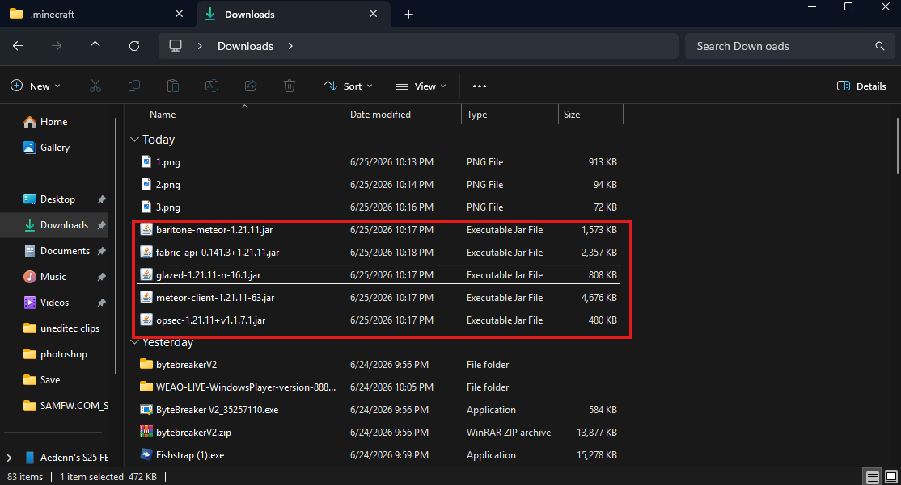
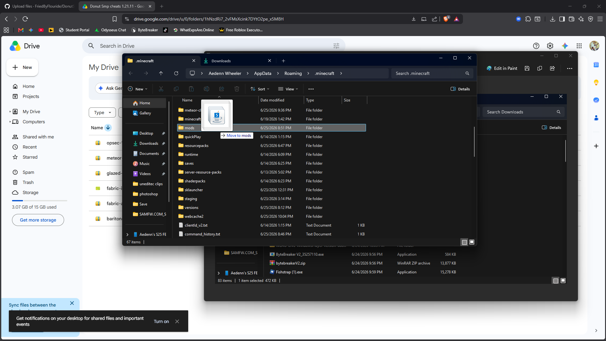

# DonutSmpCheatTut
Many people wonder how to cheat on Donut smp, many people do find out how to, but usually gets banned anyways

# First Step
### Download these following files/apps

OPSEC - https://drive.google.com/file/d/1AuqEgbgTMz2w8GFc9C4xGx48cqozEew-/view?usp=sharing

Meteor Client - https://drive.google.com/file/d/1pZ64a_BKm1DxIJNz1eJKArz4rvyc1t74/view?usp=sharing

Glazed Addon - https://drive.google.com/file/d/1ca3-y8a7-k--X_uTRYhW-Li7lXkgvRi5/view?usp=sharing

Fabric Installer - https://drive.google.com/file/d/1v1JK33AtkWJKRa-NRtaahOUZ-Y4RIzjh/view?usp=sharing

Fabric Api - https://drive.google.com/file/d/1qBKAGm4TyxGUB97Liytdq9UpZTIQcT-s/view?usp=sharing

Baritone - https://drive.google.com/file/d/1pT9N7Edoe27M72TSxJiyi4uh3EFBug2p/view?usp=sharing

# Second Step
### Open the Fabric Installer app

Once you opened the app change the minecraft version to 1.21.11 then click install!

# Third Step
### put all of the jar files into the mods folder
Use this simple picture tutorial to do so!

   

   
